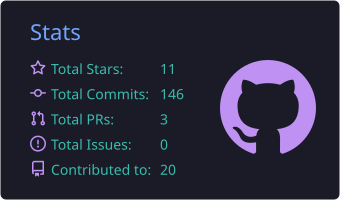
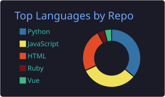

# Hi, I'm Kaison.


---

```
ID: Kaison | kaisonlau8 | After-sales ops × AI products
```

> By day I sit in service-operations meetings at **Dongfeng M-Hero** (Wuhan).
> I also build **[LAN Cloud AI / 兰芯云朵](https://github.com/LAN-Cloud-AI)** — [lancloudtech.com](https://lancloudtech.com) —
> turning dealership chaos (inspections, complaints, NSS, DMS, store networks, public-domain signals)
> into **trackable, reviewable, executable** products.
>
> Same method, two surfaces: tools that already run in real stores,
> and a product line other dealers can open.

## Resume

- [中文简历](https://kaison-cv.41box.com/) — full Chinese version
- [English Resume](https://kaison-cv.41box.com/en/) — English version
- [LAN Cloud AI](https://lancloudtech.com) · [组织仓](https://github.com/LAN-Cloud-AI)

## Building · LAN Cloud AI

> Business rules × bitable / event systems × AI.
> Prove in real stores, then SaaS-ify behind contracts.

```text
See         LeadsHunter     public content → business signals → actionable leads
Understand  VECT            fragmented CRM → relationship temperature → risk + owner
Orchestrate TACT            work orders → trusted state → explainable dispatch
Judge       Agents          trusted samples → counter-intuitive insight → layered action
```

| Product | One-liner | Status |
| --- | --- | --- |
| **[LeadsHunter](https://github.com/LAN-Cloud-AI/leadsHunter)** | Customers aren't silent — they just aren't speaking inside your CRM | Mercury in production · Venus + sales APP in field test |
| **VECT** | They say "it's fine" — the system sees they're leaving | Feishu-proven → SaaS prep |
| **[TACT](https://github.com/LAN-Cloud-AI/TACT)** | The car isn't late yet — the system already sees where delay will form | Phase 0 contracts · Public |
| **[Cloud Ledger](https://github.com/LAN-Cloud-AI/LAN_Cloud_Internal_Expense)** | Subscriptions & reimbursements on Workers / D1 / R2 | Public |
| **兰芯裂变** | Commerce + referral growth (WeChat mini program / App) | Production · Private |
| **[艺匠市集](https://github.com/LAN-Cloud-AI/artist-marketplace)** | Independent-artist shop, full-stack example | [Public demo](https://alien.lancloudtech.com) |

### Public-domain leads

| Repo | What it is | Visibility |
| --- | --- | --- |
| [leadsHunter](https://github.com/LAN-Cloud-AI/leadsHunter) | Mercury production + Venus three-pool (ownership → org-assign → account-dispatch) and mobile API | Private |
| [LH_evaluation_agent](https://github.com/LAN-Cloud-AI/LH_evaluation_agent) | Comment + post scoring: intent, summary, evidence, next action | Private |
| [leadsHunter_APP](https://github.com/LAN-Cloud-AI/leadsHunter_APP) | Expo iOS/Android sales client: home / leads / notifications, Getui, 10:00 digest; Android beta | Private |
| [LH_Training_Ground](https://github.com/LAN-Cloud-AI/LH_Training_Ground) | Industry + SKU training ground; skills sync back to production | Public |

### Company surface

| Repo | What it is | Visibility |
| --- | --- | --- |
| [LAN_Web_Homepage](https://github.com/LAN-Cloud-AI/LAN_Web_Homepage) | Official site · lancloudtech.com | Public |
| [LAN_Wechat_Official_miniProgram](https://github.com/LAN-Cloud-AI/LAN_Wechat_Official_miniProgram) | Official WeChat mini program | Private |
| [lanxin-Fission-Frontend](https://github.com/LAN-Cloud-AI/lanxin-Fission-Frontend) / [Backend](https://github.com/LAN-Cloud-AI/lanxin-Fission-Backend) | Fission mall: DIY storefront, invite / assist, wallet | Private |
| [LAN_AI_Course_System](https://github.com/LAN-Cloud-AI/LAN_AI_Course_System) | AI course materials (public pages on the site) | Private |

Private links 404 if you are not a collaborator. That is expected.

## Shipping · M-Hero after-sales

> The digital middle platform that paid for the method — still shipping.

- [**m-hero**](https://github.com/kaisonlau8/m-hero) — tool-set map, docs, and dependency overview `(2026)`
- [**m-hero-hub**](https://github.com/kaisonlau8/m-hero-hub) — console yellow pages + port heartbeat `(2026)`
- [**VIP maintenance alert**](https://github.com/kaisonlau8/m-hero-vip-custom-alert) — DMS reminder → VIP match → Feishu nudge `(2026)`
- [**Accident-vehicle reminder**](https://github.com/kaisonlau8/accident-vehicle-reminder) — never let a repair case go silent `(2026)`
- [**Store timeout audit**](https://github.com/kaisonlau8/m-hero-store-timeout-audit) — Feishu diff + 17:00 daily bot + dashboard `(2026)`
- [**Timeout coverage console**](https://github.com/kaisonlau8/store-timeout-cleaner) — WeCom group coverage vs timeout-bot replies `(2026)`
- [**scrm-api**](https://github.com/kaisonlau8/scrm-api) — production WeCom SCRM OpenAPI notes `(2026, private)`
- [**Regional report generator**](https://github.com/kaisonlau8/mhero_district_form) — drop in 7 Excels, fill the template, export `(2026)`
- [**OEM sentiment monitor**](https://github.com/kaisonlau8/oem-sentiment-monitor) — 东风天眼: public-domain brand risk board + agent `(2026)`
- [**Store service-network map**](https://github.com/kaisonlau8/m-hero-store-map) — store list → China geomap → coverage pins `(2025)`
- **Feishu bitable middleware** — HTTP CRUD over multi-dimensional tables `(2025)`
- **iParts analysis** — DMS / parts import + analysis pipeline `(2024)`
- **Q1 inspection data product** — complaint merge → store match → per-row LLM summary / risk / advice → report `(2026, internal)`

## How I work

- **Service-ops diagnosis**: throughput, output value, gross margin, 1st/2nd maintenance, renewal, NSS — region compare, structure, anomaly hunt on **DMS / FineBI / Excel**.
- **Inspection digitalization** & one-store-one-file on **Feishu bitable**, scored and turned into a reusable quarterly report pipeline.
- **LLM in production**: DashScope / DeepSeek / Anthropic for summaries, risk tags, inspection linkage, disposition; custom agents rather than chat demos.
- **Product loops I actually run**: crawler → warehouse → agent score → three-pool assign → sales APP (LeadsHunter Venus; Mercury still the production cutover); DMS session keepalive → export → match → nudge (M-Hero).
- **Full-stack**: Python (FastAPI, scrapers, agents), Node / Hono, Vue3, React + Vite, Expo, a bit of Go and Ruby.
- **Glue that stays up**: Feishu bots + bitable, Cloudflare Workers / Access / D1 / R2, GitHub Actions, cron, launchd.
- Comfortable owning the whole loop: business problem → data model → API → frontend → "it just runs every day".

## Environment

OS:


Tools:


## Side quests

When the hands itch, I ship random things:

- [**41box.com**](https://github.com/kaisonlau8/41box.com) — dark-mode imported used-car site + [serverless heartbeat](https://github.com/kaisonlau8/41box_heartbeat_detection).
- [**wechat-reading-vocabulary**](https://github.com/kaisonlau8/wechat-reading-vocabulary) — exported WeChat-Reading word lists → queryable bank with definitions & TTS.
- [**volc-proxy**](https://github.com/kaisonlau8/volc-proxy) — local Anthropic ↔ Volcano Engine protocol bridge.
- *...and an attic full of: an ncm music decoder, YOLOv8 letter detection, a railway-locomotive traction calculator.*

## Honest gaps

- Self-taught and business-first — code optimizes for "ships today and survives Monday's meeting" over textbook clean.
- No systematic algorithm / CS training; still filling those gaps.
- I reach for an LLM maybe a little too fast. Working on knowing when *not* to.

## Stats

<p align="center">
  
  
</p>

<sub>↑ Cards are generated by a GitHub Action and committed into this repo — served by GitHub itself, no third-party runtime.</sub>
